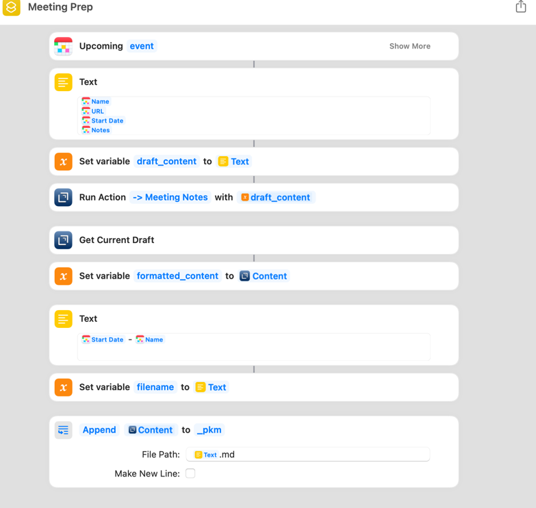
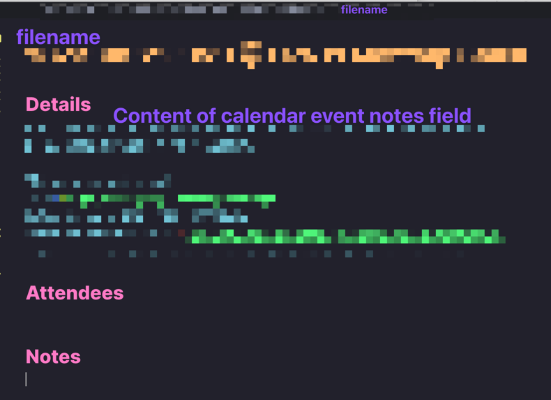

# Shortcuts - Meeting Prep w/ Meeting Notes Template

## tl;dr
Takes your upcoming calendar event and formats ready-to-go meeting notes.

## Ingredients
- Fantastical (you could probably use any calendar app)
- Drafts (you could replace this with the built-in **Replace Text**)
- note-taking app or folder location for the file

## Steps
### Drafts Action
This could be replaced by another templating engine, but I definitely recommend a templating engine over using the **_Replace Text_** action in Shortcuts. It's just too much to manage and you have more flexibility using something like Drafts.
1. In Drafts, Actions > Manage Actions
2. Choose the action group (like Processing) or create a new one
3. Click Add (+) below the action list on the right
4. Name the action "-> Meeting Notes" or whatever
5. Add step Create Draft
6. In the template section paste in 
```markdown 
# [[line|3]] - [[line|1]]
   at [[line|2]]

## Details
[[line|4..]]

## Attendees


## Notes
```
7. Change any other settings as desired then save the action and close the windows.

### Wire up the Shortcut
1. Create a new Shortcut named _Meeting Prep_ (or whatever)
2. Pull in the **upcoming event(s)** from your calendar app
3. Create a **Text** block
4. In the same order required by your template, insert the variables into the text block
```markdown
Calendar Item (Name)
Calendar Item (URL)
Calendar Item (Start Date)
Calendar Item (Notes)
```
5. Set variable `draft_content` to Text
6. Run action `-> Meeting Notes` with `draft_content`
7. Get current Draft
8. Set variable `formatted_content` to Draft Content
9. New Text Block with `Calendar Item (Start Date) - Calendar Item (Name)`
10. Set variable `filename` to Text.
11. Append to Text File
    - Text = `formatted_content`
    - Folder = path to your Obsidian vault or notes
    - File Path = `filename`
    - 
## Outcome

